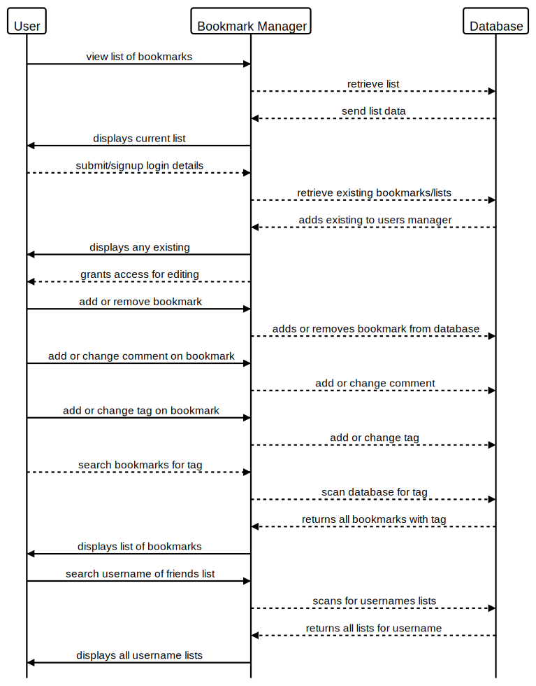

User story
```
As a user
So that I can keep my bookmarks 
I want to be able to create a bookmark and save it
```
```
As a user
So that I can see what bookmarks I have
I want to be able to view all of the bookmarks I’ve created in a list format
```
```
As a user 
So that I can keep my bookmark list relevant
I want to be able to delete a bookmark
```
```
As a user
So that have see comments on the bookmarks
I want to be able to added comments onto the bookmarks
```
```
As a user
So that I can keep my bookmarks organised
I want to add a tag to a bookmark (When it’s being created)
```
```
As a user
So that I can search for a bookmark
I want to be able to search for a bookmark by it’s tag
```
```
As a user
So that I can view other peoples bookmarks
I need to be able to search for a username and view their bookmarks
```
```
As a user
So that I can save my bookmarks
I want to be able to sign up to the bookmark manager
```
```
As a user 
So that I can change or edit my bookmarks
I want to be able to log into bookmark manager
```
```
Domain model
